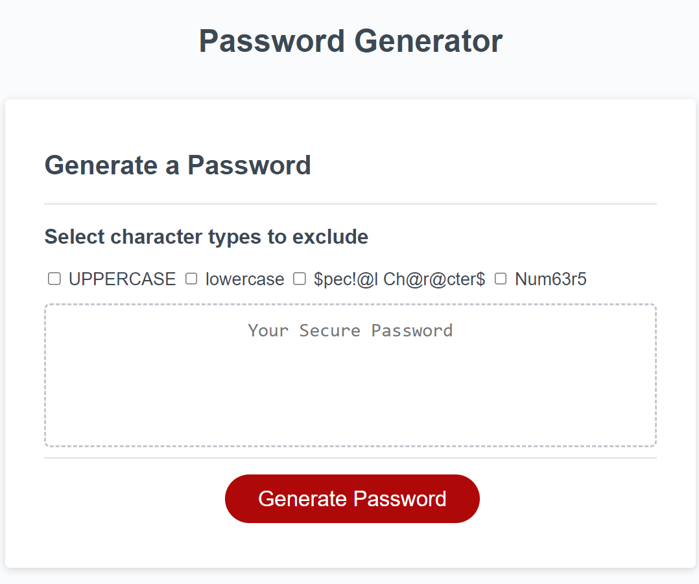

# Password Generator

## Description 

This tool allows users to generate a random password based on a set of input criteria. Once navigated to the page https://roqieux.github.io/Password-Generator/, users can specify which types of characters to use in the password generation by checking boxes to exclude certain types of characters. By default all character types are included because this will generate the most secure passwords. 

## Image 

Site mockup image is below.

## Credits

Work on this project performed by Rqoieux.
Materials referenced include:

  https://developer.mozilla.org/en-US/docs/Web/JavaScript/
  Solved student mini project from week 3 

## License 

See the license in the repo. 

